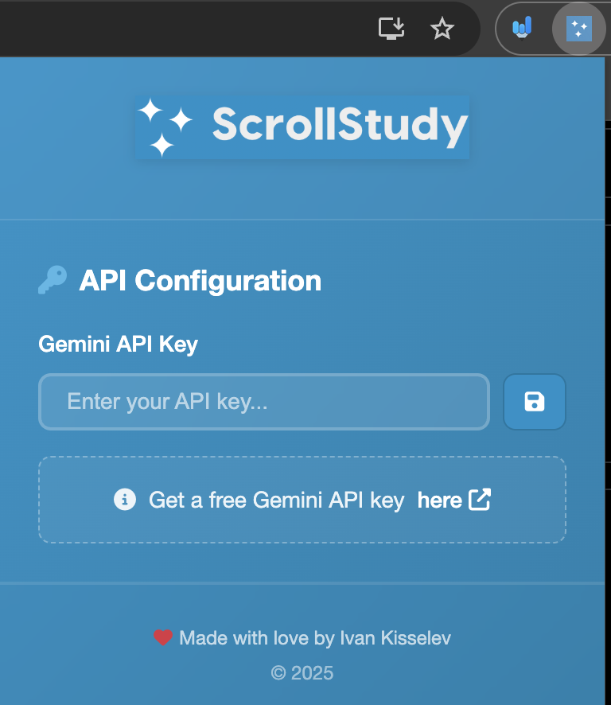
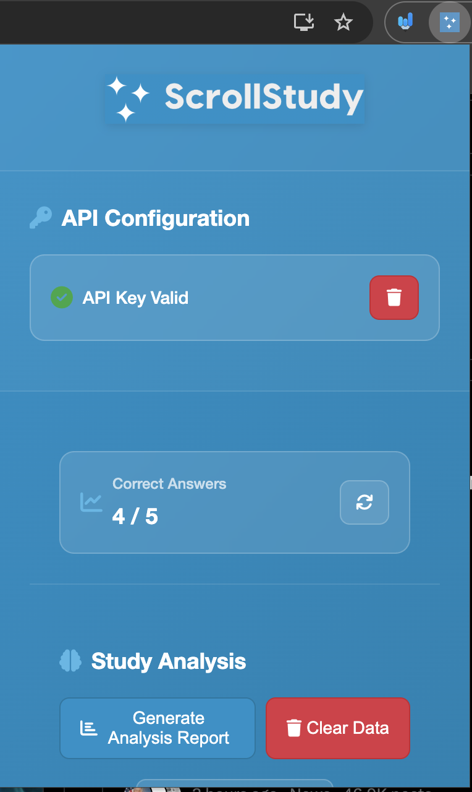
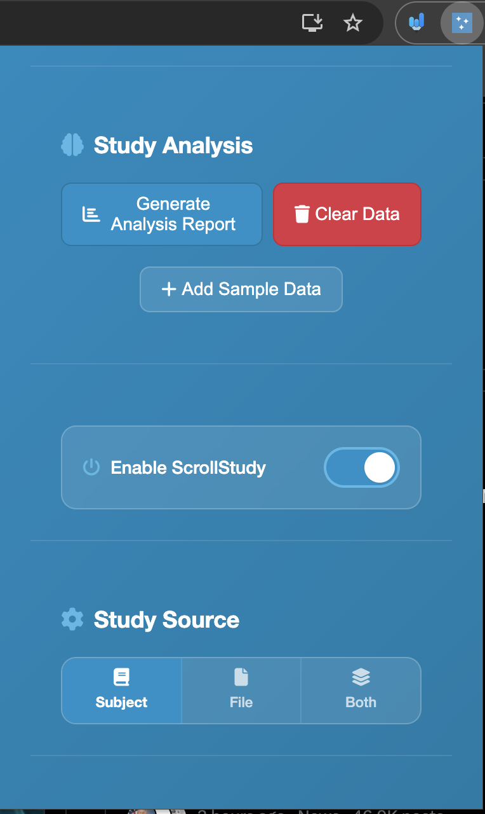
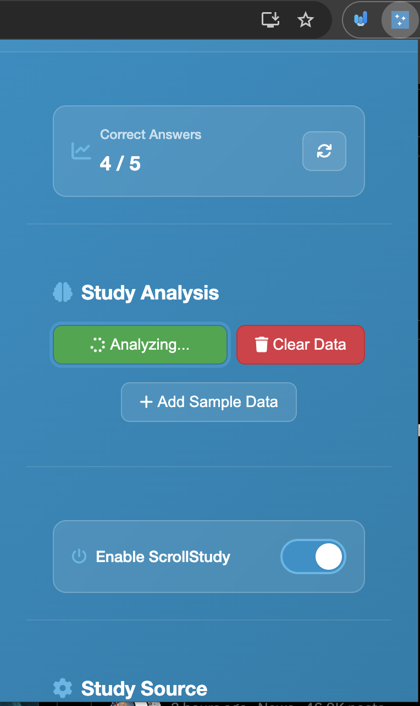
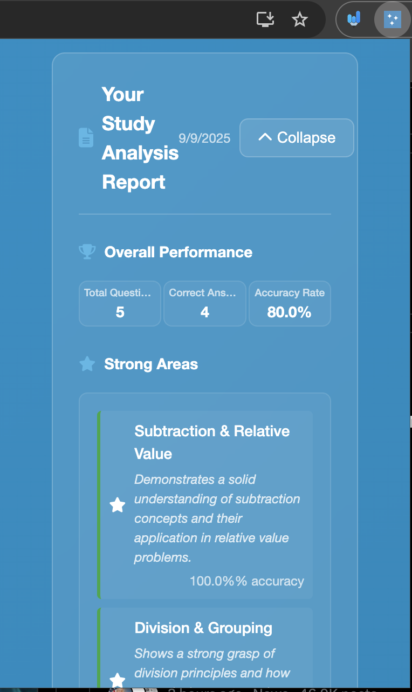
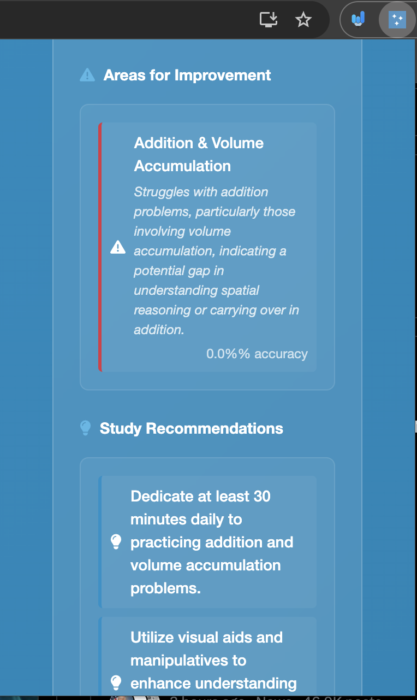
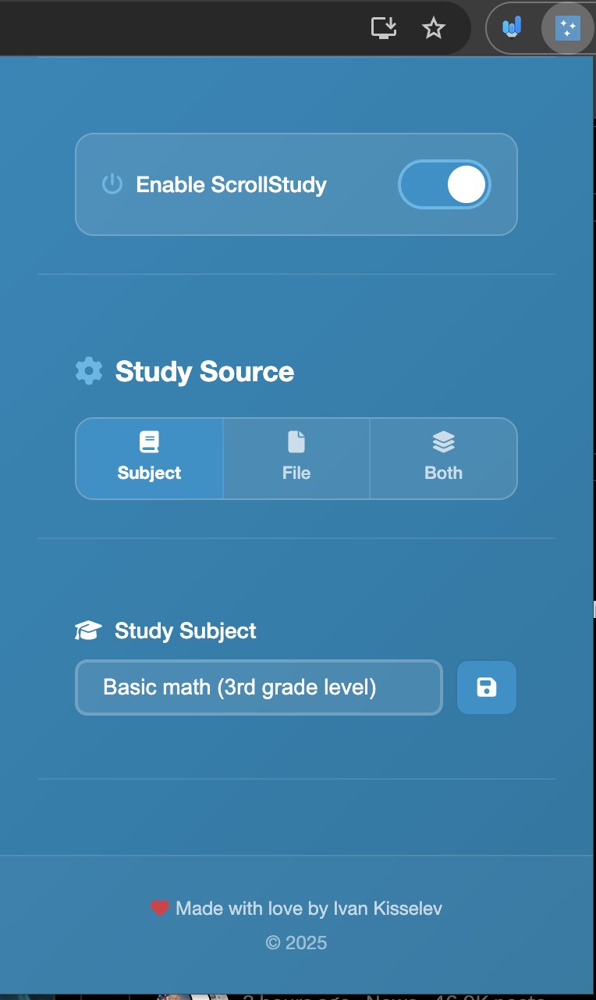
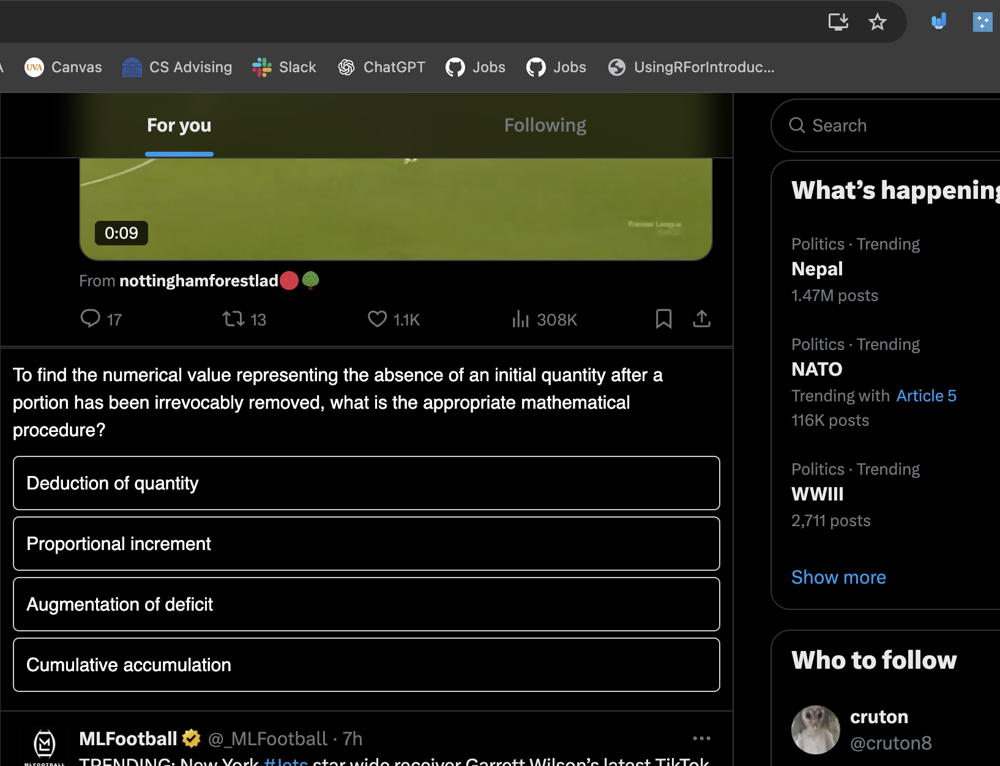
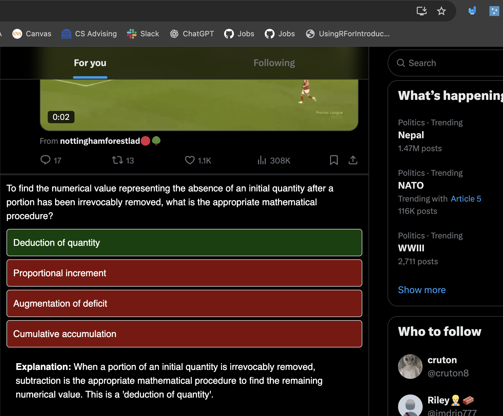

# Study While Scrolling Your Favorite Social Media Site!

Built primarily using JavaScript, HTML, and CSS with Fetch API to make and recieve API calls to the Gemini 2.0 Flash (experimental) model. 

## Description

NOTE: This project is currently a work in progress. Some features are currently in development and have not yet been integrated. 

Have you ever been unmotivated to study and just want to scroll the day away on social media? Now you can do both at the same time! ScrollStudy is a Chrome extension which dynamically injects 
study material into your social media feed, all generated by Google's new Gemini 2.5 Flash (experimental) model. Simply install the extension, specify your desired study subjects, and watch as your feed is 
seamlessly transformed into a productive space! ScrollStudy allows you to provide subject descriptions and files to base its study material off of, all while providing you the necessary feedback about how your studying is going.

## Planned Features
* Support for more social media sites
* Support for images in questions
* Improved UI design
* More customization for questions (difficulty, question style, etc.)
* Detailed analysis and feedback on user's strengths and weaknesses
* And more!

## Current Demo Images

